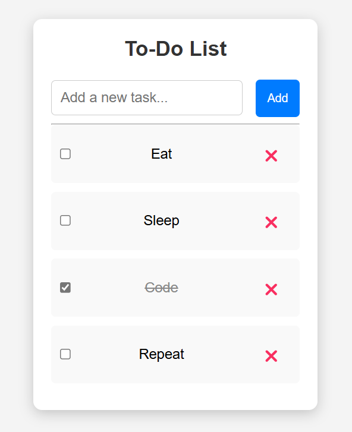

# 📋 Optimize To-Do List ✅

A lightweight and optimized To-Do List application built with Neutralino.js. Unlike traditional Electron apps, this entire application is just `16MB`, making it super fast and efficient while still offering essential task management features. 🚀

## 🚀 Features
<ul>
<li>⚡ Ultra-Lightweight: Only 16MB compared to bulky Electron apps</li>
<li>📝 Add, Edit & Delete Tasks</li>
<li>✅ Mark Tasks as Completed (Line-through effect)</li>
<li>💾 Persistent Storage (LocalStorage)</li>
<li>🎨 Minimal & Responsive UI</li>
</ul> 

## 🛠 Installation & Setup
1️⃣ Clone the Repository:
git clone `https://github.com/aryan-lokhande/Optimize_to-do-list.git`
 cd Optimize_to-do-list

2️⃣ Install Neutralino.js CLI (if not installed): 
`npm install -g @neutralinojs/neu`

3️⃣ Run the Project:
neu run

## 🖥 Screenshots

